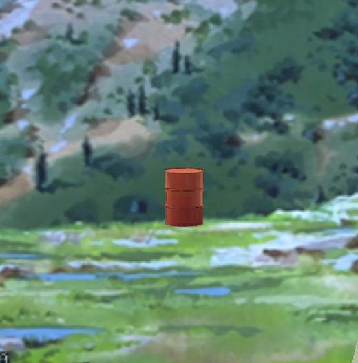
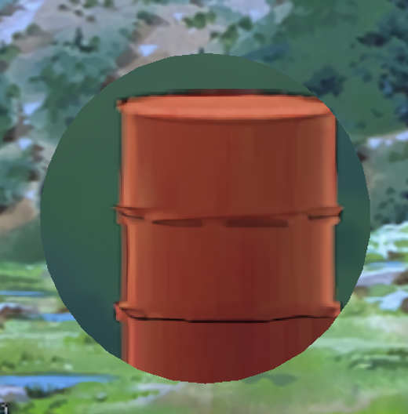
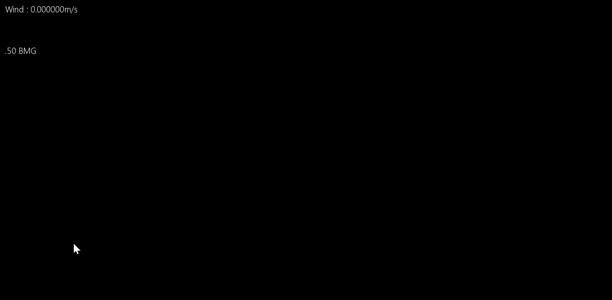

# 마테리얼 스나이퍼 모작

🛠️ **개발 도구**

 

📅 **개발 기간**

2024.11.15 ~ 2024.11.25 (약 2주)

플래시 슈팅 게임 마테리얼 스나이퍼를 모작한 프로젝트입니다.

**마테리얼 스나이퍼**의 리소스를 활용했습니다.

---

## 🛠️ 주요 구현 요소

### 렌더 텍스쳐를 이용한 확대경
 

### 중력, 공기 항력에 의한 탄도 구현

### 화면 및 조준경 반동

### 조준경 흔들림
